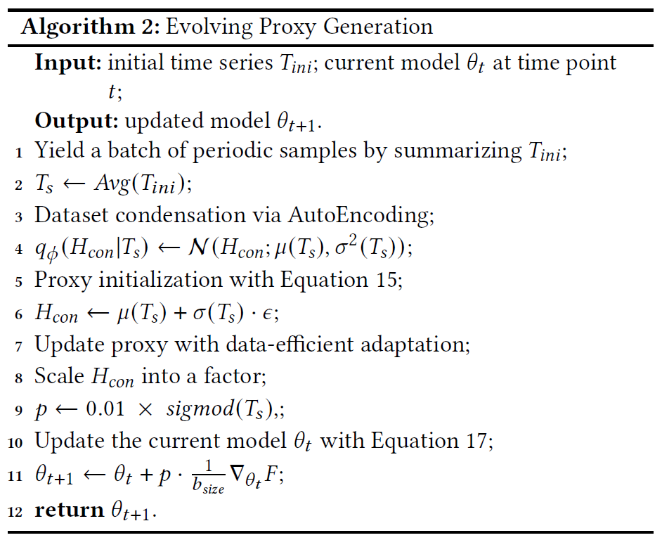

# Evolving Proxy Kills Drift: Data-Efficient Streaming Time Series Anomaly Detection


### Train and Evaluate
You can reproduce the experiment results by running scripts in `./scripts/`:
```
bash ./scripts/run.sh
```

### Datasets

_**SMAP**_, _**PSM**_, _**MSL**_, _**SWaT**_, _**SMD**_, and _**UCR**_ can be downloaded from [Google Drive](https://drive.google.com/drive/folders/1KOQvV2nR6Y9tIkB4XELHA1CaV1F8LrZ6).

#### Dataset Details 

- **SMAP**  
  The SMAP dataset provides 25-dimensional time series capturing the behavior of satellite subsystems during nominal operations and fault episodes.

- **PSM**  
  The PSM dataset is collected from eBay’s internal systems, including 25-dimensional multivariate time series showing server resource usage such as CPU, memory, and I/O.

- **MSL**  
  The MSL dataset contains time series of spacecraft telemetry from the Curiosity rover of NASA, where anomalies are denoted as mission incident reports.

- **SWaT**  
  The cyber-physical SWaT dataset is collected from a water treatment testbed with 51 sensors, where anomalies denote cyber-attacks under continuous control operations. 

- **SMD**  
  The SMD dataset is collected from a server monitoring Internet company, including 38-dimensional time series and anomalies reflecting system faults and service degradation.

- **UCR**  
  The UCR dataset includes a wide range of domains, such as human activity recognition, sensor networks, and financial data.

### Algorithm 2
The whole process of the evolving proxy generation is shown
in Algorithm 2, where lines 1–6 state the proxy initialization and
lines 7–11 show the data-efficient adaptation.
<p align="center">

</p>


###  Environment
 Install Pytorch3.11 and the required packages.
```
pip install -r requirements.txt
```
